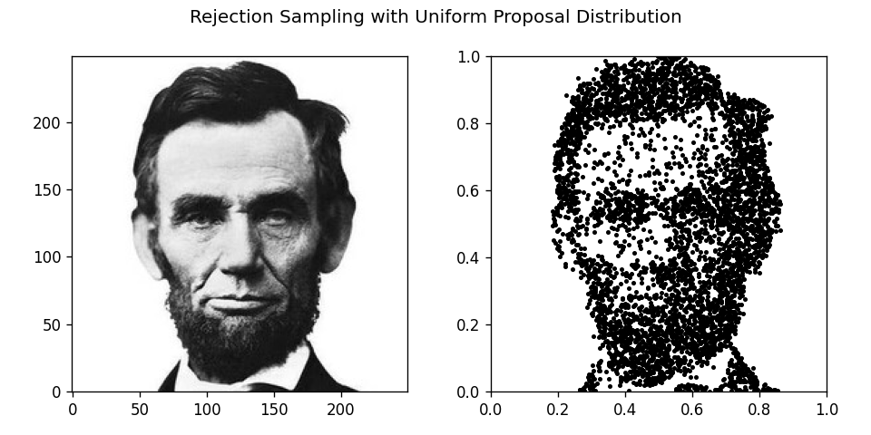
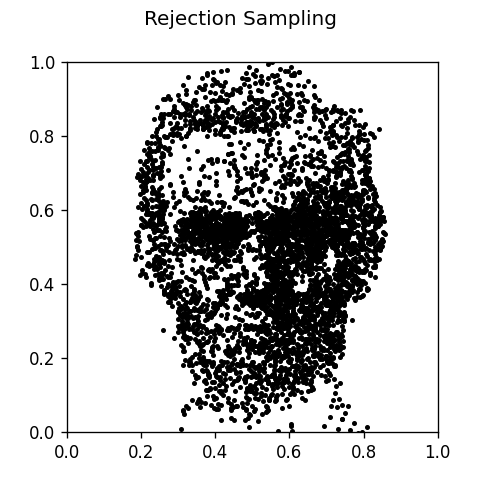
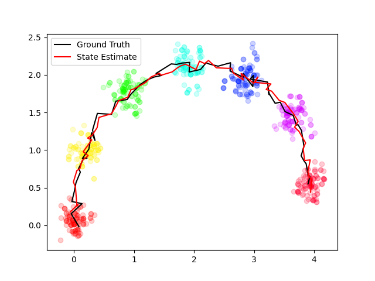
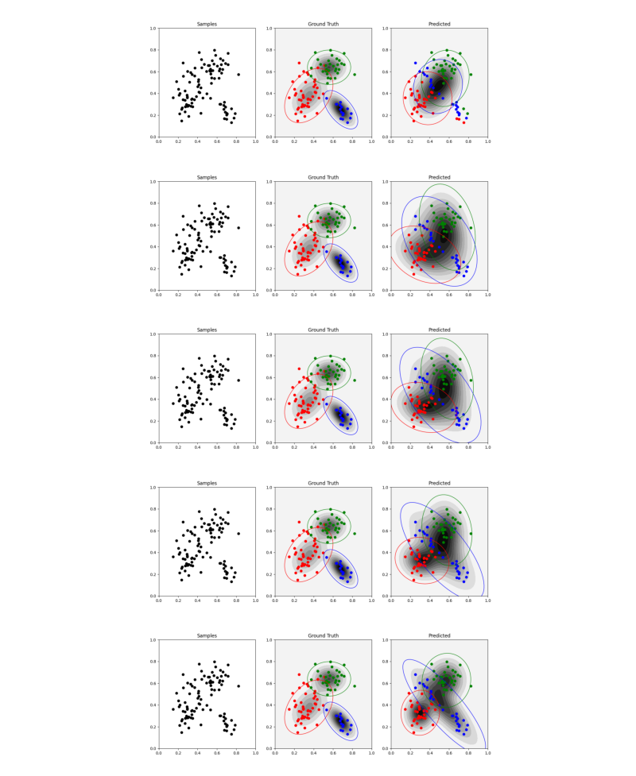
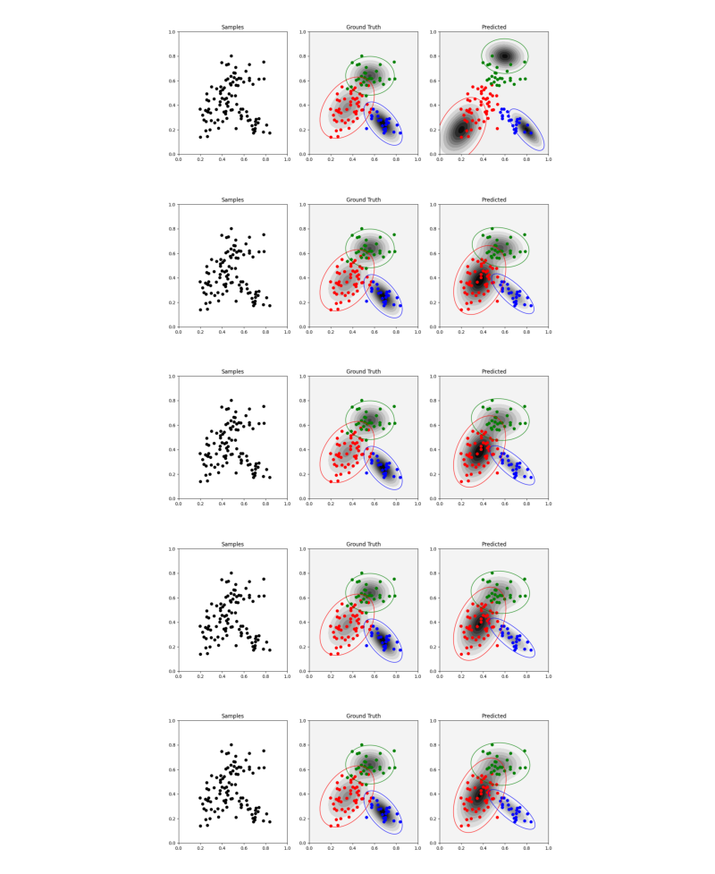

## HOMEWORK-3

### Question 1
- Rejection Uniform Sampling

- Rejection Normal Sampling

### Question 2

- Particle Filter

### Question 3

- Non Converging GMM EM

- Converging GMM_EM where initial mean and sigma were set closer to the real value for test

