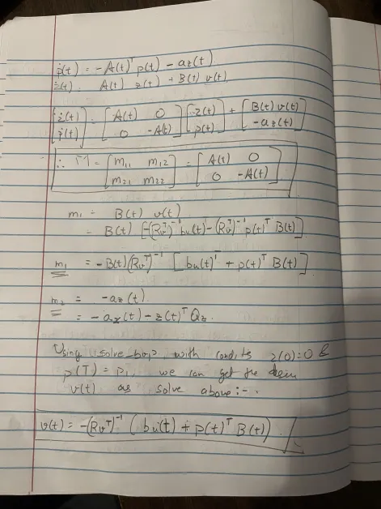

### <u>HOMEWORK-4</u>

### Question 1

    

### Question 2

### Question 3

1. With Constant Control Signal

2. With Random Normal Distribution

3. With Random Uniform Distribution

3. With x as a cos distribition and y with input

4. With y as a cos distribition and x with input

